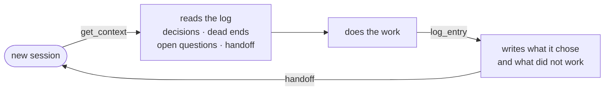
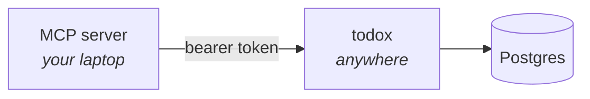

<h1>todox</h1>

**Working memory for developers and their agents.**
Not a checklist — a log your next session can actually resume from.

[](https://github.com/beydemirfurkan/todox/actions/workflows/ci.yml)
[](LICENSE)
[](https://todox-omega.vercel.app)

---

An issue tracker is written human-to-human. todox is written agent-to-agent,
with a human reading over its shoulder. Every task carries the decisions behind
it, the approaches that failed, the questions still open, and the note the last
session left behind.



The point is the second lap. A fresh agent starts where the last one stopped,
and does not walk into a wall somebody already hit.

## What goes in a log

| kind | what it means |
| --- | --- |
| `decision` | what you chose, and why the alternatives lost |
| `dead_end` | an approach that did **not** work — the highest-value entry, because it stops the repeat |
| `question` | something only a human can answer |
| `handoff` | end-of-session state, written for a stranger |
| `note` | everything else |

Two more things fall out of treating the log as the product:

- **Stale context is flagged.** Linked files are hashed when they are linked. If
  the code moves on, `get_context` says the note may be lying. Context that lies
  is worse than none.
- **Reports come from the log, not from commits.** Every status change is an
  event, so *what did I finish today, how long did it take, which model did it*
  is a query rather than archaeology.

## Try it

**[todox-omega.vercel.app](https://todox-omega.vercel.app)** — anyone can
register. It is a small personal deployment, not a service with an uptime
promise. Self-host if the log matters to you.

## Run your own

```bash
pnpm install
cp .env.example .env.local     # any Postgres; a free Neon branch works
pnpm db:migrate                # idempotent
pnpm seed                      # optional demo account: demo / todox-demo
pnpm dev
```

## Connect an agent



The MCP server never touches the database. It authenticates with a per-user
token and calls the HTTP API, so an agent on a laptop and data on a host stay in
step — one code path, no local/remote drift. The trade-off: the server has to be
up for the agent to work.

Create a token on the Account page and it hands you the command:

```bash
claude mcp add todox \
  --env TODOX_TOKEN=todox_… \
  --env TODOX_URL=https://todox-omega.vercel.app \
  -- pnpm -C /path/to/todox exec tsx mcp/server.ts
```

### Tools

| tool | what it does |
| --- | --- |
| `get_context` | **Call this first.** Standing rules, project decisions and gotchas, every open task with its decisions, dead ends, questions, files and last handoff — plus stale-file warnings. Resolves a project from a slug, a name, or any path inside it. |
| `create_task` | Capture work. Pass `cwd` and it finds the project, **registering one for that repo if it has never seen it** — so the agent never stops to ask. |
| `update_task` | Status, title, body, priority. Moving to `doing`/`done` is where durations come from. |
| `log_entry` | Append one of the five kinds. |
| `activity_report` | Today / this week / any window: durations, models, importance, decisions, dead ends, open questions. `format:"markdown"` is written to be pasted into a status update. |
| `link_files` | Attach paths and hash them for staleness. |
| `add_context` | Knowledge that outlives a task; omit the project to make it account-wide. |
| `search` | Across all your projects — *have I solved this before?* |

Every write tool takes a `model`, and the server instructions tell the agent to
always pass it. That is what makes the per-model breakdown real rather than
guessed.

## Deploying

Vercel plus a hosted Postgres.

| variable | why |
| --- | --- |
| `DATABASE_URL` | Postgres. Use the pooled connection string. |
| `TODOX_PUBLIC_URL` | Verification and reset links are built from it — get it wrong and people land on the wrong host. |
| `RESEND_API_KEY` · `MAIL_FROM` | Optional. Without them, mail is printed to the server log rather than sent. |

Run `pnpm db:migrate` when the schema changes. It deliberately does not run on
cold start: DDL racing across serverless instances is a bad way to discover lock
contention.

Coming from the old SQLite version? `pnpm db:import-sqlite [path]` copies a
`~/.todox/todox.db` across.

## Security

Passwords are scrypt; sessions, agent tokens and email links are stored as
hashes only. Ownership is enforced in one module, and a row belonging to someone
else answers 404 rather than 403 so ids cannot be probed. Rate limits live in
the database, so they hold across instances.

Details, and an honest list of what is **not** covered, in
[SECURITY.md](SECURITY.md).

## Known gaps

- Search is `ILIKE`, not full-text.
- Staleness is per-file hash; per-symbol would be the honest version.
- No 2FA, no per-session revocation, no audit log.
- Share links are unlisted, not access-controlled.
- No keyboard navigation beyond `/` for search.

## Contributing

Rules the codebase actually follows, and how to run the checks:
[CONTRIBUTING.md](CONTRIBUTING.md).

MIT — see [LICENSE](LICENSE).
